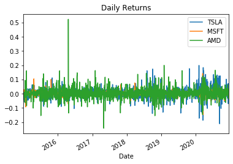
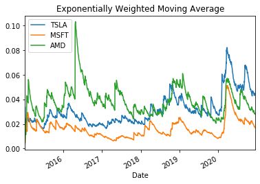
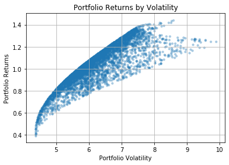
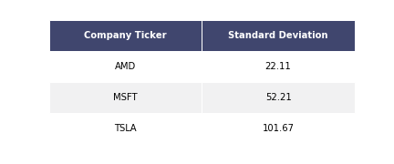
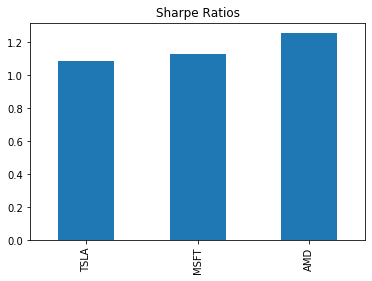
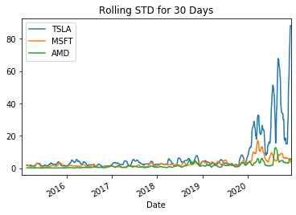
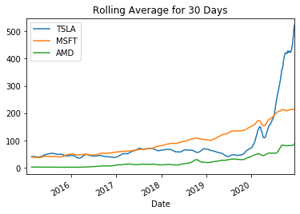

# FinEdu

This is an educational notebook designed to help newcomers approach algorithmic trading by helping users understand the models involved with making replicable decisions. We’ll show you how to become an informed trader in 10 minutes by providing the tools to visualize the market based on price changes, this will help you devise a strategy to trade a group of stocks and maximize expected returns.

In this educational notebook, you will learn about the subjects as below:

## Historical Analysis

Performance and Risk Analysis are helpful to understand how a stock performed within a time frame. 

#### ***Performance Analysis***

* **Daily Returns**
* Purpose: Looking at the daily returns of stocks helps to see daily performance comparisons.
  
    
   
* **Cumulative Returns**
* Purpose: A cumulative return on an investment is the aggregate amount that the investment has gained or lost over time, in a time period.

     

* **Exponentially Weighted Moving Average**
* Purpose: The EWMA of a stock can be used as a condfidence indiacator, meaning that a strong but declining stock should have a hard time moving below the EWMA. EWMA can help you to determine what actions to take with an asset depending on its relative position to the close price.

   

#### ***Risk Analysis***

* **Risk Analysis**
* Purpose: Risk Analysis is a good tool to weigh the risk versus return for an entire portfolio or a single asset or security.

    

* **Standard Deviation**
* Purpose: The Standard Deviation (STD) is a measure of the volatility of a stock.

    

* **Sharpe Ratio**
* Purpose: The ratio describes the compensation an investor will receive for the extra volatility endured when holding a riskier asset.
  
    

* **Rolling Standard Deviation**
* Purpose: The Rolling STD looks at changes in volatility over time.

    
    
* **Rolling Mean**
* Purpose: Taking the 30 day rolling average smoothes the graphs and makes it easier to see overall trends.

    

#### ***Forecasting***

* **Monte Carlo Simulation**

* Purpose: The underlying concept is to use randomness to solve problems that might be deterministic in principle.

    

